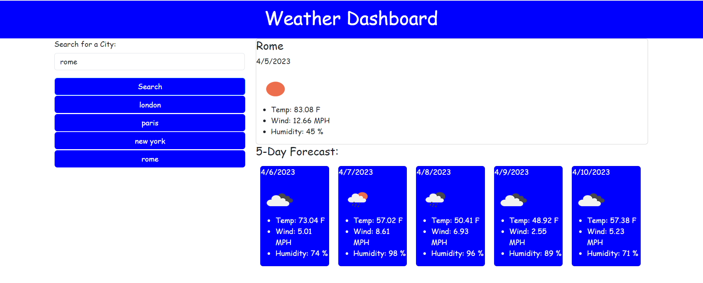

# weather-dashboard
this is the 6th assignment

# About
This project is about a weather dashboard. Users will type a city name into the input, and this input will be sent as part of an API URL. The first API URL will get the data needed for the second API, which will provide the same day forecast and the 5-day forecast. In this project, we also used local storage, which means that when the user types the data, the input will be saved and a new button will be created based on the input. When the page is refreshed, the input will still be there.

note:comments have been added to the java script file as per last feedback, if thats not the needed action thanks to tellme

# tools
used java scrips comands we learned in Bootcamp class plues google, youtube and everything i could to make it work.

# page url
https://mounirwassef.github.io/weather-dashboard/

# screan shot 
below purview
